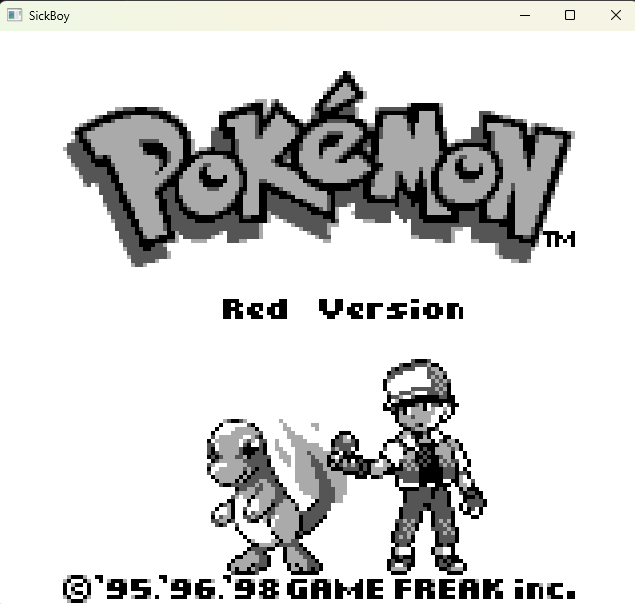

# SickBoy
Game Boy emulator (currently only DMG, no CGB/GBA) written in modern C++. The project is in an early phase and while it can successfully boot and run a lot of titles there is still much work to be done.

This started as a learning project but is slowly turning into a full-featured emulator.

## Accuracy
Sickboy is meant to be a cycle accurate emulator, but there are a few minor exceptions to this at the moment:
- OAM DMA transfers are instant instead of taking up 160 M-cycles
- CPU and PPU ticks are not interleaved meaning that the PPU will not see mid-instruction changes in the VRAM

Overall I would still categorize SickBoy as a very hardware accurate emulator. Any perceptible deviations should be considered as a bug.

### Tests
Sickboy passes the following test suites:
- blargg `cpu_instrs` tests ([Link](https://github.com/retrio/gb-test-roms))
    - Proves CPU and interrupt handling correctness
- GameboyCPUTests `v2` tests ([Link](https://github.com/adtennant/GameboyCPUTests))
    - Proves CPU correctness
- dmg-acid2 ([Link](https://github.com/mattcurrie/dmg-acid2))
    - Proves PPU accuracy with a lot of edge-cases
- Mooneye Test Suite MBC tests ([Link](https://github.com/Gekkio/mooneye-test-suite/))
    - Proves MBC correctness

## Platform support
Sickboy uses a minimal number of dependencies and aims to be compatible with all major platforms (Window/Linux/Mac) and architectures (x86-64/ARM). Mobile support (iOS/Android) is currently not implemented, but should not be difficult to add.

## Compilation
To compile Sickboy all you need is a recent version of CMake (v3.20 or newer) and a C++20 compatible compiler.
Make sure you are cloning the repository using the `--recursive` flag or use `git submodule update --init` to initialize the `vcpkg` submodule. Afterwards simply call `compile.bat` or `compile.sh` (depending on your system) to compile the project.

## Notable missing features
There a few important features missing at the moment:
- Sound
- RAM and VRAM locking
- Few different MBC implementations
- Persistance of SRAM (game saves)
- Serial data transfer
- Fast-forward (2x/3x/etc.)
- Debugging and tracing features
- Settings/configuration menus
- Game Boy Color (CGB) support
- Game Boy Advance (GBA) support

## Resources
Huge thanks to all of the following resources that were immensely useful while implementing SickBoy:
- [Pan Docs](https://gbdev.io/pandocs/)
- [Pastraiser's OP-code table](https://www.pastraiser.com/cpu/gameboy/gameboy_opcodes.html)
- All the various test suites mentioned in "Tests"
- [Gearboy](https://github.com/drhelius/gearboy) debugging and tracing features for comparison

## Legal
This project is simply an emulator and does not include any copyrighted material. The boot ROM included with the emulator is a copyright free reimplementation of the original DMG boot ROM, sourced from [Ashiepaws/Bootix](https://github.com/Ashiepaws/Bootix). You are expected to use the emulator with your own, legally owned game ROMs.

## Trivia
- Q: Was the emulator implemented from completely scratch?
- A: Yes, the only resources used for implementation are the documentation pages mentioned in "Resources"
- Q: Why is the project called "SickBoy"?
- A: Because I started working on it while I was on sick leave, bored out of my mind.
